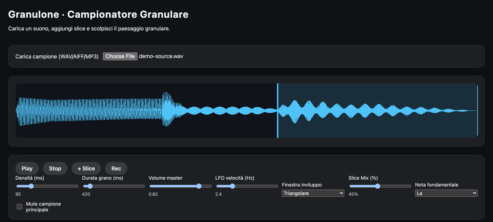
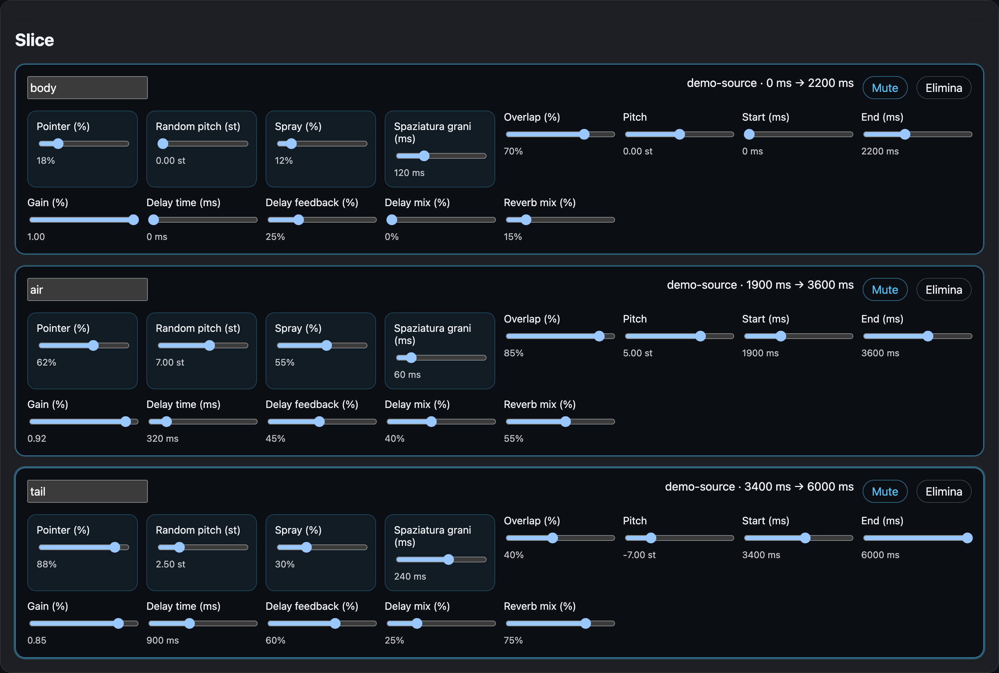

# Granulone

Campionatore granulare che gira interamente nel browser. Carichi un suono, lo tagli in slice e ogni slice diventa una voce granulare indipendente, con i suoi grani, il suo pitch, il suo delay e il suo riverbero.

Nessuna dipendenza, nessun build step, nessun server applicativo: HTML, CSS e JavaScript su Web Audio API.



## Cosa fa

Il campione caricato non viene riprodotto in modo lineare. Viene letto da una testina mobile — il *pointer* — che estrae frammenti brevi, i grani, e li rimette in coda uno dopo l'altro secondo la densità impostata. Cambiando spaziatura, durata e sovrapposizione dei grani lo stesso materiale passa da texture continua a nuvola sgranata a ritmica.

Ogni slice legge una porzione diversa del campione e ha una configurazione propria. Le slice suonano insieme, quindi da un solo file audio si costruisce una stratificazione a più voci.

Formati accettati: WAV, AIFF, MP3. Il file non lascia mai il browser — viene decodificato in locale, non c'è nessun upload.

## Le slice



Ogni slice ha un nome, un intervallo di lettura sul campione (Start / End) e un set completo di controlli:

| Parametro | Cosa fa |
|---|---|
| **Pointer** | posizione della testina di lettura dentro l'intervallo della slice |
| **Random pitch** | dispersione casuale di intonazione grano per grano, fino a 12 semitoni |
| **Spray** | dispersione casuale della posizione di lettura attorno al pointer |
| **Spaziatura grani** | intervallo fra un grano e il successivo: è il controllo di densità |
| **Overlap** | quanto ogni grano si sovrappone al precedente |
| **Pitch** | trasposizione fissa della slice, ±12 semitoni |
| **Start / End** | i due estremi della porzione di campione assegnata alla slice |
| **Gain** | volume della slice |
| **Delay time / feedback / mix** | linea di ritardo dedicata alla slice |
| **Reverb mix** | quantità di riverbero sulla slice |

Ogni slice si può silenziare singolarmente (Mute) o eliminare.

## Controlli globali

**Densità** e **Durata grano** agiscono su tutte le slice come valori di partenza. **Volume master** regola l'uscita generale, e **LFO velocità** ci applica sopra una modulazione sinusoidale da 0 a 10 Hz: è un tremolo sul volume generale.

**Finestra inviluppo** decide la forma del singolo grano, e cambia parecchio il carattere del suono: Hann e Gaussiana danno grani morbidi che si fondono, Triangolare è più definita, Rettangolare taglia di netto e produce i click agli estremi tipici della grana dura.

**Slice Mix** e **Nota fondamentale** lavorano in coppia e non sono un controllo di volume: Slice Mix è la quantità di **quantizzazione dell'intonazione**. A 0% il pitch delle slice resta libero, com'è stato impostato; salendo, l'intonazione viene tirata verso la scala maggiore costruita sulla nota fondamentale, fino alla quantizzazione completa al 100%. Serve per far cadere in tonalità le trasposizioni e le dispersioni casuali del random pitch.

**Mute campione principale** esclude il campione non processato e lascia in uscita solo le voci granulari.

## Registrazione

Il pulsante **Rec** cattura l'uscita audio mentre suoni, e a fine registrazione compare il link per scaricare il take. Usa `MediaRecorder` sul flusso in uscita: registra quello che senti, non il microfono. Granulone non chiede mai accesso al microfono.

## Avvio in locale

Serve un server statico — aprendo il file direttamente con `file://` i moduli ES non si caricano.

```bash
cd GRANULONE
python3 -m http.server 8000
```

Poi apri `http://localhost:8000/public/index.html`.

## Struttura

```
public/
  index.html               interfaccia e stili
  granulone.fallback.js    build a file singolo, senza moduli
src/
  app.js                   punto di ingresso
  granularEngine.js        motore granulare e scheduling audio
  ui.js                    controlli e binding dell'interfaccia
  waveform.js              disegno della forma d'onda
MANUALE_GRANULONE.txt      manuale utente esteso
```

`index.html` prova a caricare `src/app.js` come modulo ES. Se il caricamento non riesce — protocollo `file://`, browser senza supporto ai moduli, percorso non risolto — entra in funzione `granulone.fallback.js`, che contiene lo stesso motore in un unico file senza `import`. Le due strade sono equivalenti dal punto di vista sonoro, ma vanno tenute allineate: **una modifica ai sorgenti in `src/` va riportata anche nel file di fallback.**

## Scheduling audio

Il clock che decide quando far partire ogni grano non gira su `requestAnimationFrame`. I browser rallentano quel timer quando la scheda non è in primo piano, e con la sintesi granulare il risultato è udibile subito: grani in ritardo, audio che si inceppa o si ferma.

Il tick arriva invece da un **Web Worker** creato al volo da un Blob, con intervallo di 25 ms e una finestra di pre-scheduling di 0.2 secondi sull'audio clock: i grani vengono programmati in anticipo sul clock hardware, non nel momento in cui servono. Se il Worker non è disponibile si ricade su `setTimeout`.

È la differenza fra un'app che continua a suonare quando cambi scheda e una che si blocca.

## Browser

Serve il supporto a Web Audio API e ai moduli ES: Chrome, Firefox, Safari e Edge in versione recente.

Su iOS e Safari il contesto audio parte solo dopo un'interazione esplicita dell'utente — è una regola del sistema, non un limite di Granulone: il primo tocco su Play sblocca l'audio.
